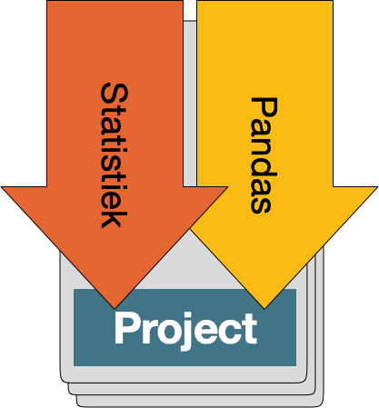

# Studiewijzer Analyseproject

**Periode**: maandag 5 januari 2025 -- vrijdag 30 januari 2025  
**Eindpresentaties**: vrijdag 30 januari 2025 hele dag

Studenten doen een **individueel project** waarin zij een **dataset analyseren**, een **notebook** maken en een **poster** om inzichten te presenteren en te verdedigen.

 Doelen zijn:
 
- een goed begrip krijgen van de taal van statistiek
- praktische ervaring opdoen met analyseren en manipuleren van data met Pandas
- ervaring opdoen met het uitvoeren een data-analyseproject
- inzicht krijgen in kwaliteit van datasets
- vragen leren bedenken die middels een dataset beantwoord kunnen worden

## Aanwezigheid

Tijdens vrijwel elk college is er een toetsje, feedback, of een voortgangsbespreking. Bijna alles is dus verplicht, en bij de paar andere colleges zonder speciale activiteit word je ook gewoon verwacht. Als je een keer ziek bent dan moet het lukken hiervoor een regeling te treffen. Je moet dan wel een mail sturen.

## Begeleiding

Over het algemeen zul je één aanspreekpunt hebben voor je project. Als je grote beslissingen neemt moet je die met de aangewezen begeleider bespreken. Die begeleider houdt een aantal zaken over jou bij tijdens het vak, zodat dit meegenomen kan worden in de beoordeling. Zorg dat je je docenten ook zelf benadert zodat dit gebeurt. De notities worden niet met je gedeeld maar voel je vrij de onderwerpen met je begeleider te bespreken.

- Voortgang met statistiek en Pandas
- Keuze dataset voor het project
- Voortgang project op elke maandag
- Welke vragen gesteld, hulp gevraagd
- Voortgang project op tijdens de bespreking op vrijdag
- Hoe project is aangepast op basis van inzicht
- Inschatting next steps en potentiële problemen

Daarnaast kunnen docenten en assistenten tijdens alle geroosterde werkgroepen helpen met alle opdrachten en vragen.

## Procesboek

In een "procesboek" moet elke student dagelijks per uur aangeven waar aan is gewerkt. Ook moeten beslissingen over de inrichting van het project worden beschreven. Het procesboek wordt gebruikt in de beoordeling en kan als bron dienen voor het verslag.

## Beoordeling

Voor een voldoende eindcijfer (6) moet je aan een aantal minimumeisen voldoen. Zie de lijstjes hieronder. Daarnaast kun je op allerlei manieren "groeipunten" verdienen. In totaal kunt je dan een 9,5 halen. Met een heel bijzonder coherent project op alle fronten kan dit, naar inzicht van het docententeam, een 10 worden.

### 1. Statistiek

**Voor een voldoende eindcijfer**

- 2 toetsjes overtuigend gehaald
- correcte toepassing van statistische analyses (t/m correlatie) in het project

**Groeipunten (tot 1 punt erbij)**

- je laat statistische nuance zien in projectverslag en -uitleg (redeneren, mitsen en maren)
- visualisaties ondersteunen in project en poster de uitleg, en andersom

### 2. Pandas

**Voor een voldoende eindcijfer**

- opdrachten allemaal af, ingeleverd én afgetekend
- kunnen uitleggen van de eigen Pandas-code van project

**Groeipunten (tot 1 punt erbij)**

- goed leesbare en overzichtelijke code in project
- geavanceerde Pandas-transformaties toegepast

### 3. Project

**Voor een voldoende eindcijfer**

- duidelijke en zinvolle onderzoeksvraag
- passende datasets
- goede uitleg van beperkingen dataset in verslag
- nette statistische analyse
- notebook is reproduceerbaar
- poster is begrijpelijk

**Groeipunten (tot 1 punt erbij)**

- vernieuwende of elegante onderzoeksvraag en -aanpak
- originele inzichtelijke visualisaties
- aantoonbaar iteratief gewerkt
- verdiept statistisch redeneren in uitwerking

### 4. Proces

**Voor een voldoende eindcijfer**

- procesboek compleet en geloofwaardig
- twee feedbackrondes benut en aantoonbaar verwerkt
- consequente deelname aan activiteiten

**Groeipunten (tot 0,5 punt erbij)**

- expliciet uitgewerkte procesverslag met uitleg van iteratief werken
- peer feedback gegeven op hoog niveau
- sterke reflecties in het verslag

Zoals je ziet ligt er een hoop verantwoordelijkheid bij jou om vorm te geven aan je werk in het vak. Als je redelijkerwijs de instructies volgt kom je wel een heel eind, maar zorg echt zelf dat je je leren zichtbaar maakt.

Als het misgaat met een eis uit de kolom "Voor een voldoende eindcijfer" betekent dat niet dat je het vak meteen helemaal niet gaat halen. Bespreek het met je begeleider/docent en stel een oplossing voor. Hoe langer je wacht, hoe kleiner de kans dat er nog een oplossing mogelijk is.

## Weekoverzicht

Bijeenkomsten met specifieke activiteiten zijn sowieso verplicht. Alle bijeenkomsten behalve vrijdag zijn in lokaal L0.10.

### Week 1: Datasetselectie en statistiek

| Dag       | Activiteit                             | Locatie |
| --------- | -------------------------------------- | ------- |
| Maandag   | Kick-off statistiek & pandas & project | L0.10   |
| Dinsdag   | Huiswerk (statistiek en pandas)        | thuis   |
| Woensdag  | Toetsje statistiek 1 + start Project   | L0.10   |
| Donderdag | Huiswerk (project uitwerken)           | thuis   |
| Vrijdag   | Voortgangsbespreking                   | Lab42   |

- **Maandag**
    - 11:00 Kick-off project: wat ga je doen, hoe werkt statistiek, hoe werkt pandas
    - 13:00 Werkcollege
        - Statistiek: oefeningen en starten met de online cursus
        - Installatie-check Pandas, don't leave the room before it works!!!
        - Starten met de Pandas-notebook, assistentie

- **Dinsdag**
    - Huiswerk! Statistiek t/m spreidingsmaten, dus les 1 t/m 4
    - Oefenen met de pandas-notebook
        - Paragraaf: Dataframes
        - Paragraaf: Series
        - Paragraaf: Handling missing values

- **Woensdag**
    - 10:00 <mark>Toetsje</mark> Statistiek deel 1
        - Over: meten en schalen, tabellen, centrummaten en spreidingsmaten
    - 11:00 Kort overzicht project
        - Gesprek: wat is een goede dataset?
        - Handout kwaliteits-eisen
    - 11:20 Werken aan project en Pandas (aftekenen vanaf 12:00 uur)
        - Zelf dataset zoeken die interessant is
        - Werken aan oefenopdracht Pandas, met assistentie
        - Project-notebook beginnen

- **Donderdag**
    - Thuis werken aan project
    - Inladen data
    - Voorstellen bedenken onderzoeksvraag
    - Beschrijven van de kwaliteit van de dataset en de variabelen
    - 16:00 <mark>Deadline</mark> Project-notebook Milestone 1

- **Vrijdag**
    - Voortgangsbespreking: groep van 5, duurt ongeveer 1 uur
        - Presenteren van dataset en karakteristieken
        - Feedback van medestudenten en van docent, next steps

### Week 2: Databeschrijving

| Dag       | Activiteit                                   | Locatie |
| --------- | -------------------------------------------- | ------- |
| Maandag   | Intro Pandas                                 | L0.10   |
| Dinsdag   | Huiswerk (statistiek en pandas)              | thuis   |
| Woensdag  | Toetsje Statistiek 2 + feedbackronde project | L0.10   |
| Donderdag | Huiswerk (project)                           | thuis   |
| Vrijdag   | Voortgangsbespreking                         | Lab42   |

Milestone project op vrijdag: dataset ingeladen in een Pandas-gebaseerde notebook en statistische beschrijving/visualisaties.

- **Maandag**
    - 13:00 Plotjes maken Seaborn
    - 13:00 Aftekenen van dingen die vorige week niet af waren
    - 13:30 Werken aan Pandas-notebook
        - Paragraaf: Indexing, Selection and Masking
        - Paragraaf: Operating on Dataframes

- **Dinsdag**
    - Huiswerk! Statistiek t/m correlatie, dus les 5, 6 en 7
    - Thuis werken aan Pandas-opdracht
        - Paragraaf: Map
        - Paragraaf: Sorting values
        - Paragraaf: Grouping

- **Woensdag**
    - 10:00 <mark>Toetsje</mark> statistiek deel 2
        - Over: scheefheid, transformaties en correlatie
    - 11:00 Rondje individuele feedback op data-inzichten en notebook
    - 12:00 Aftekenen voortgang Pandas

- **Donderdag**
    - Thuis werken aan project
    - Analyse van de variabelen, en van correlaties in de data
    - 16:00 <mark>Deadline</mark> Project-notebook Milestone 2

- **Vrijdag**:
    - Voortgangsbespreking: groep van 5, duurt ongeveer 1 uur
        - Presenteren van variabelen en correlaties
        - Feedback van medestudenten en van docent, next steps

### Week 3: Onderzoeksvraag en Web Scraping

| Dag       | Activiteit                               | Locatie |
| --------- | ---------------------------------------- | ------- |
| Maandag   | Instructie visualisaties                 | L0.10   |
| Dinsdag   | Huiswerk (project)                       | thuis   |
| Woensdag  | Werken aan visualisaties + feedbackronde | L0.10   |
| Donderdag | Huiswerk (project)                       | thuis   |
| Vrijdag   | Voortgangsbespreking                     | Lab42   |

Milestone project op vrijdag: vraag beantwoord en uitgelegd aan de hand van verfijnde stats en visualisaties.

- **Maandag**
    - 13:00 Instructie visualisaties
        - Visualisaties maken
        - Beantwoorden van de onderzoeksvraag

- **Dinsdag**
    - Huiswerk! Data-analyse en visualisaties maken

- **Woensdag**
    - 10:00 Peer-feedbackronde visualisaties
    - 10:45 Werken aan project-notebook en feedback van docenten

- **Donderdag**
    - Thuis werken aan project
    - Zoeken van aanvullende datasets (niet per se inladen)
    - Analyse missing values en conclusies
    - 16:00 <mark>Deadline</mark> Project-notebook Milestone 3

- **Vrijdag**:
    - Voortgangsbespreking: groep van 5, duurt ongeveer 1 uur
        - Presenteren van analyses en conclusies
        - Wat kan er volgende week gepresenteerd worden?

### Week 4: Posters en presentaties

| Dag       | Activiteit                     | Locatie |
| --------- | ------------------------------ | ------- |
| Maandag   | Instructie posters maken       | L0.10   |
| Dinsdag   | Deadline poster (15:00)        | thuis   |
| Woensdag  | Deadline verslag (15:00)       | L0.10   |
| Donderdag | Voorbereiding eindpresentaties | thuis   |
| Vrijdag   | Eindpresentaties               | Lab42   |

- **Maandag**
    - 13:00 Instructie posters maken
    - 13:30 Werken aan posters, eerste schetsen, peer feedback

- **Dinsdag**
    - Thuis werken aan de poster
    - 15:00 <mark>Deadline</mark> poster drukklaar
        - Wij printen de poster voor je op groot formaat

- **Woensdag**
    - 10:00 Werken aan Pandas notebook-verslag, laatste feedback docenten
    - 15:00 <mark>Deadline</mark> verslag ingeleverd als notebook

- **Donderdag**
    - Voorbereiding eindpresentatie: wat wil je vertellen bij de poster?

- **Vrijdag**
    - 10:00 Eindpresentaties, vragen van docenten beantwoorden
    - 12:00 Kick-out

## Contact en uitzonderingen

Voor vragen of aanvullende begeleiding: neem contact op via e-mail of spreek de begeleider aan tijdens de practica.

Alle vormen van uitzonderingen moeten per mail worden afgesproken. Mondelinge afspraken zijn niet geldig.

**Succes!** 🚀
