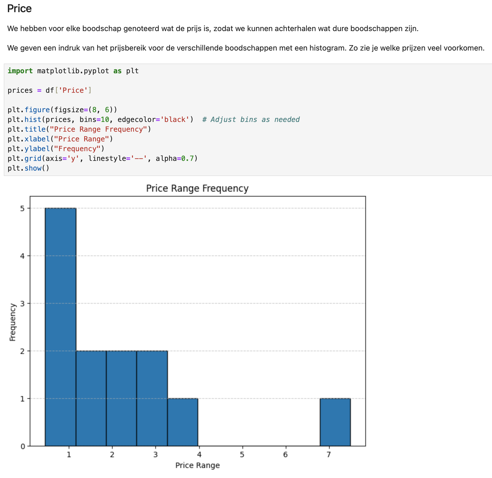
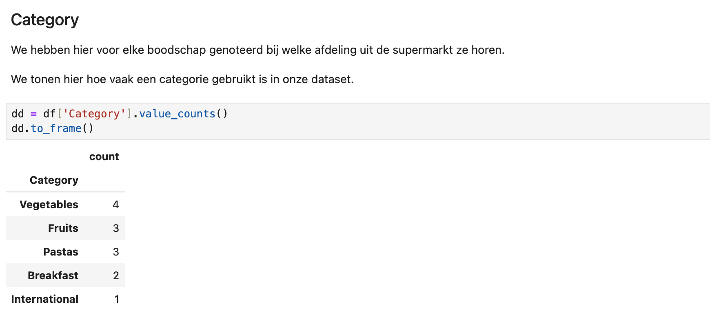
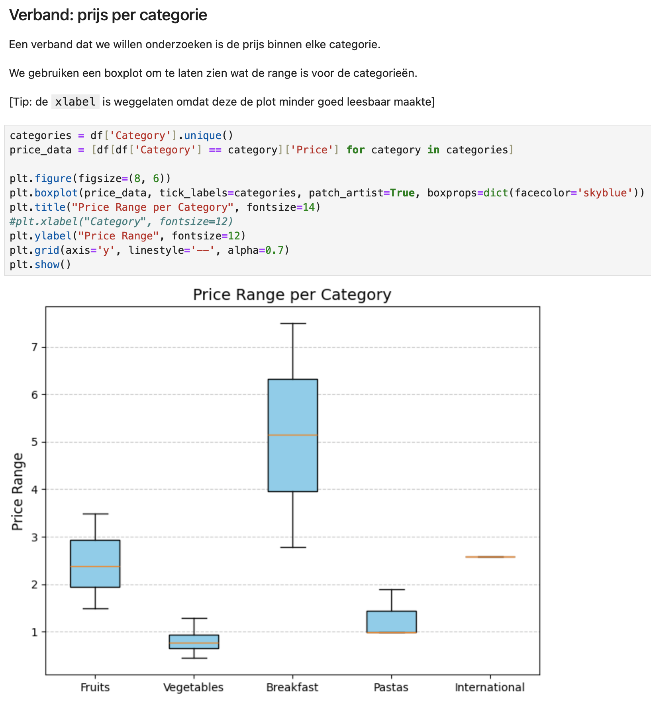

# Kwantitatief

Als je enquetevragen hebt gesteld (mondeling of schriftelijk) waarvoor deelnemers eenvoudige antwoorden konden geven, zoals leeftijd, opleidingsniveau, ervaring met dit of dat, gebruik van welke apps, dan moet je deze kwantitatief organiseren en analyseren.

Je gaat eerst alle vragen die zo te analyseren zijn in één bestand krijgen, bijvoorbeeld in Excel. Je gaat alle kolommen weghalen waarin hele vrije antwoorden gegeven konden worden, omdat die niet statistisch te analyeren zijn.

De kolommen bevatten nu *variabelen*, zoals we dat noemen in de statistiek. Je gaat de data inladen in een Notebook (met Pandas) en met basis-statistieken een indruk geven van elke variabele.

## Stap 1. Data downloaden

Via het enquete-systeem moet je een Excel of CSV kunnen downloaden met daarin alle verzamelde gegevens.

Kijk of het lukt om deze in te laden in Excel en hoe het eruit ziet.
Verwijder alle kolommen (variabelen) die geen éénduidige antwoorden bevatten. Zaken als leeftijd, politieke voorkeur, welk merk telefoon, gender kunnen allemaal blijven. Check met je begeleider als je denkt dat een variabele weggelaten kan worden.

## Stap 2. Inladen in Pandas

Maak een nieuwe Notebook met Pandas (copy-paste de startcode uit de Pandas-oefening). Maak dan een cel waarin je de code schrijft om het databestand (een CSV) in te laten in een Pandas dataframe genaamd `df`. Daarna kun je de data tonen door op de laatste regel te zetten:

    df.head()

Hiermee worden de eerste tien regels van de data getoond zodat je kunt inspecteren of het klopt.
Gaat er iets mis, los dit dan op.

## Stap 3. Indruk per variabele

Maak per variabele een Markdown-cel met een kopje en uitleg waarom je die vraag gesteld hebt. Hier twee voorbeelden van hoe het eruit kan zien. Soms laat je een samenvatting van de data zien, soms een grafiek (of allebei). Door de kopjes blijft het overzichtelijk.

Doe dit voor alle variabelen in de dataset.

## Stap 4. Verbanden onderzoeken

Bestudeer de verbanden tussen verschillende variabelen. Kijk welke het meeste inzicht zouden kunnen geven in het probleem en maak er een gecombineerde samenvattende tabel van, of een plot. Hieronder kiezen we voor een boxplot om gemiddelde en bereik van prijzen in één keer inzichtelijk te maken.

Doe dit voor zoveel mogelijk zinvolle verbanden in de data. Als je niet weet hoe je iets moet doen, zoek het op.

## Volgende stap

Met deze Notebook heb je het begin van een "theorie" die helpt begrijpen wat er speelt rondom jullie onderwerp.

Bedenk alvast voorzichtig hoe de data je kan helpen inzicht te krijgen in het probleem of hoe deze zelfs je onderzoeksvraag zou kunnen beantwoorden.

De resultaten ga je opnemen in het verslag dat je donderdag moet inleveren. Zie de aparte pagina voor instructies.
