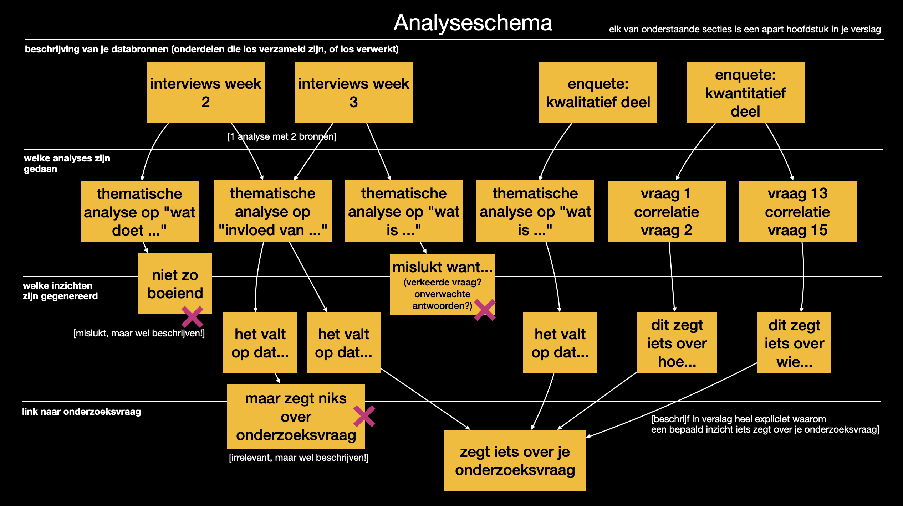

# Verslag

Je hebt deze week weer kwalitatieve en kwantitatieve data verzameld en/of geanalyseerd.

Nu is het zaak om alles overzichtelijk te maken zodat je begeleider zorgvuldig mee kan lezen en ook meedenken.

Het is een min of meer definitief verslag, hoewel we verwachten dat jullie nog verbeteringen zullen moeten doen.

- Het hele verslag, inclusief kwalitatieve analyse, moet aangeleverd worden in een PDF.

- Alle transcripties (van vorige week en deze week) moeten in bijlagen worden bijgevoegd. Let hierbij op dat je alleen dingen opneemt waarvoor je consent hebt en dat het anoniem is maar wel op een of andere manier genummerd.

- Eventuele kwantitatieve analyse moet apart aangeleverd worden in een Notebook + een datafile. De datafile **moet** `raw_data.csv` heten.

## Eisen aan het verslag

1. Begin je verslag weer zoals bij het voorstel met namen, onderwerp en introductie.

2. Leg uit waar het onderzoek over gaat:

    - gekozen thema
    - de gevonden onderzoeksvraag (de meest recente versie van vóór de laatste dataverzameling)

2. Beschrijf hoe je data hebt verzameld (welke datums, doelgroepen, manier, welke vragen enz). Dit is een deel van wat we de "methode" noemen. Welke analyses je doet hoor daar ook bij, maar die beschrijf je bij de volgende stap.

3. Beschrijf op basis van je analyseschema je onderzoek. Elk van de 4 onderdelen moet een apart hoofdstuk worden, met daarin heel zorgvuldig alle aparte delen uitgewerkt.

    

    Dus even voor de duidelijkheid, de verwachte hoofdstukken:
    
    1. Beschrijving verschillende databronnen of onderdelen (nummer ze D1 en verder)
    2. Beschrijving van de verrichte analyses (nummer elke analyse A1 en verder) met verwijzing naar databronnen en uitleg resultaten
    3. Beschrijving van de inzichten die uit de analyses komen, georganiseerd per analyse of op een nuttige manier gegroepeerd (nummer elk inzicht I1)
    4. Beschrijving in hoeverre jullie inzicht hebben in de onderzoeksvraag, door inzichten aan elkaar te relateren.

    Elk onderdeel moet beschreven worden in het verslag, maar je moet ook heel expliciet zijn in 
    de verbanden die je legt (databronnen X en Y gebruiken we voor een analyse van categorie Z, resultaten zijn...)

4. Vergeet de genummerde bijlagen niet:

    - Per interview een aparte bijlage met identificatie
    - Per face-to-face enquete een aparte bijlage met identificatie
    - Enquete is geen bijlage maar wordt in Notebook aangeleverd
    - ...

## Doel

Hiermee heeft je begeleider voldoende om in te lezen voor het gesprek vrijdag.
Daar gaan jullie belangrijke beslissingen nemen over het vervolg van het onderzoek. Waarschijnlijk moeten er dingen opnieuw, of je hebt extra of andere data nodig. Bespreek dit!
